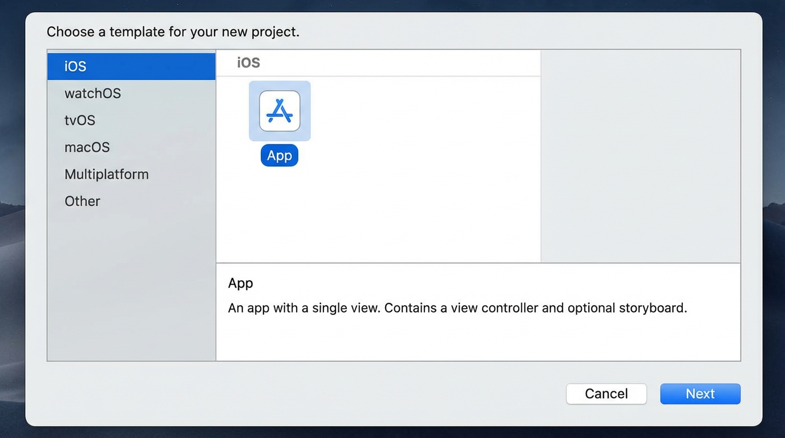

# Getting Started: New App with DaVinci (From Scratch)

This guide walks you through creating a **new iOS app in Xcode** and adding **DaVinci** so you can run and test image loading on the **simulator** or a **physical device**—without using the `Examples/DaVinciLab` Xcode project.

If this flow works for you, you can rely on it instead of the Examples folder.

---

## What you’ll need

- **Xcode 15+** (recommended)
- **macOS** with Xcode installed
- **DaVinci** either:
  - on your Mac at a local path (e.g. your clone of the repo), or
  - from GitHub (once the package is published)

---

## Part 1 — Create a new iOS app

### Step 1.1 — New project

1. Open **Xcode**.
2. **File → New → Project** (or press **⇧⌘N**).
3. In the template chooser:
   - Select **iOS**.
   - Choose **App**.
   - Click **Next**.



### Step 1.2 — Project options

4. Set:
   - **Product Name:** e.g. `DaVinciTest`
   - **Team:** your development team (required for device).
   - **Organization Identifier:** e.g. `com.yourname`
   - **Interface:** **Storyboard** (simplest for this guide) or SwiftUI.
   - **Language:** **Swift**.
   - **Storage:** leave unchecked.
   - Uncheck **Include Tests** if you want a minimal project.
5. Click **Next**, choose a folder, then **Create**.

### Step 1.3 — Confirm the app runs

6. Select the **DaVinciTest** (or your app) scheme and a **simulator** (e.g. iPhone 16).
7. Press **⌘R** to run.
8. You should see the default empty app (blank or “Hello World” style).  
   If it runs, continue. If Xcode crashes or the project fails to open, fix that before adding the package.

---

## Part 2 — Add the DaVinci package

You can add DaVinci from a **local path** (your clone) or from **GitHub**. Use **local** while developing the library.

### Option A — Local path (recommended for testing)

1. **File → Add Package Dependencies…**
2. In the bottom-left, click **Add Local…**.
3. Browse to the **root folder of the DaVinci repo** (the folder that contains `Package.swift`).  
   Example: `/Users/yourname/Desktop/Workspace/DaVinci`
4. Click **Add Package**.
5. Ensure the **DaVinci** library is checked and your app target is selected.
6. Click **Add Package** again.

You should see **DaVinci** under **Package Dependencies** in the Project Navigator.

### Option B — From GitHub

1. **File → Add Package Dependencies…**
2. In the search field, enter:
   ```
   https://github.com/cjsarria/DaVinci.git
   ```
   (Replace with your fork URL if you use one.)
3. Set **Dependency Rule** to **Up to Next Major** and choose the version (e.g. `0.3.0`) or **Branch** `main`.
4. Click **Add Package**.
5. Select the **DaVinci** library and your app target → **Add Package**.

---

## Part 3 — Add a screen that loads an image

We’ll add one view that displays a single image loaded with DaVinci.

### Step 3.1 — Storyboard (if you chose Storyboard)

1. Open **Main.storyboard**.
2. Drag a **UIImageView** onto the default view controller’s view.
3. Add **Constraints** so it’s centered and has a reasonable size (e.g. 300×300), or use **Add Missing Constraints**.
4. In the **Identity** inspector, set the **Storyboard ID** of the view controller to `MainViewController` (or leave default).
5. In the **Document** outline, select the image view and open the **Attributes** inspector; set **Content Mode** to **Aspect Fit** (optional).
6. Create an **outlet** from the image view to your view controller:
   - Open the **Assistant** editor (split view) with your view controller’s Swift file.
   - **Control-drag** from the image view to the class body and add an outlet named `imageView`.

### Step 3.2 — Code: load image with DaVinci

Open the view controller Swift file (e.g. `ViewController.swift` or `MainViewController.swift`).

1. Add the import at the top:
   ```swift
   import DaVinci
   ```
2. In `viewDidLoad()` (or `viewDidAppear`), set the image using a public test URL:
   ```swift
   override func viewDidLoad() {
       super.viewDidLoad()
       let url = URL(string: "https://picsum.photos/600/600")!
       imageView.dv.setImage(with: url)
   }
   ```
3. If you didn’t use a storyboard outlet, create the image view in code and add it to the view hierarchy, then call `imageView.dv.setImage(with: url)`.

**Example (code-only view controller):**

```swift
import UIKit
import DaVinci

final class ViewController: UIViewController {
    private let imageView: UIImageView = {
        let v = UIImageView()
        v.contentMode = .scaleAspectFit
        v.translatesAutoresizingMaskIntoConstraints = false
        return v
    }()

    override func viewDidLoad() {
        super.viewDidLoad()
        view.backgroundColor = .systemBackground
        view.addSubview(imageView)
        NSLayoutConstraint.activate([
            imageView.centerXAnchor.constraint(equalTo: view.centerXAnchor),
            imageView.centerYAnchor.constraint(equalTo: view.centerYAnchor),
            imageView.widthAnchor.constraint(equalToConstant: 300),
            imageView.heightAnchor.constraint(equalToConstant: 300)
        ])
        let url = URL(string: "https://picsum.photos/600/600")!
        imageView.dv.setImage(with: url)
    }
}
```

---

## Part 4 — Run on the simulator

1. Select your app scheme (e.g. **DaVinciTest**).
2. Choose an **iPhone simulator** (e.g. iPhone 16).
3. Press **⌘R**.
4. When the app launches, you should see the image load in the image view (e.g. a Picsum photo).  
   If the image appears, DaVinci is working in the simulator.

**Troubleshooting:**

- **No image:** Check the device has network access (simulator usually does). Try a different URL (e.g. `https://httpbin.org/image/png`).
- **Build error “No such module DaVinci”:** Ensure the DaVinci package is added and your app target has the **DaVinci** dependency (see Part 2). Try **File → Packages → Reset Package Caches** and build again.
- **Xcode crash on opening project:** Do not use the `Examples/DaVinciLab/XcodeApp` project for this test; use the **new** project you created in Part 1.

---

## Part 5 — Run on a physical device

1. Connect your **iPhone** (or iPad) and unlock it. Trust the computer if prompted.
2. In Xcode, select your **app scheme** and change the run destination to your **device** (e.g. “Your iPhone”).
3. **Signing:**
   - Select the **project** in the navigator → your **app target** → **Signing & Capabilities**.
   - Choose your **Team**.
   - If needed, set **Bundle Identifier** to a unique value (e.g. `com.yourname.DaVinciTest`).
4. On the device, go to **Settings → General → VPN & Device Management** and trust your developer certificate if this is the first time.
5. Press **⌘R** to build and run.
6. The app should install and launch; the same image should load on the device.

**If the app doesn’t install:** Check that the device is selected as the run destination, that signing has no errors, and that you’ve trusted the developer on the device.

---

## Summary checklist

| Step | Action |
|------|--------|
| 1 | Create new iOS App project in Xcode (File → New → Project → App). |
| 2 | Add DaVinci: **Add Package Dependencies** → Add Local (path to DaVinci repo) or add from GitHub. |
| 3 | Add **DaVinci** to your app target. |
| 4 | Add a `UIImageView` (storyboard or code), then in code: `import DaVinci` and `imageView.dv.setImage(with: url)`. |
| 5 | Run on **simulator** (⌘R) and confirm the image appears. |
| 6 | Run on **device**: select device, set signing, run (⌘R). |

Once this flow works, you have a reliable way to test DaVinci without opening the Examples Xcode app. You can delete the `Examples` folder later if you no longer need the benchmark app or prefer to rely on this from-scratch setup.

---

## Optional: SwiftUI version

If you created a **SwiftUI** app instead of Storyboard:

```swift
import SwiftUI
import DaVinci

struct ContentView: View {
    private let url = URL(string: "https://picsum.photos/600/600")!

    var body: some View {
        DaVinciImage(url: url, options: .default) {
            Rectangle().fill(Color.gray.opacity(0.3))
        }
        .frame(width: 300, height: 300)
        .clipped()
    }
}
```

Run the same way (simulator or device).
